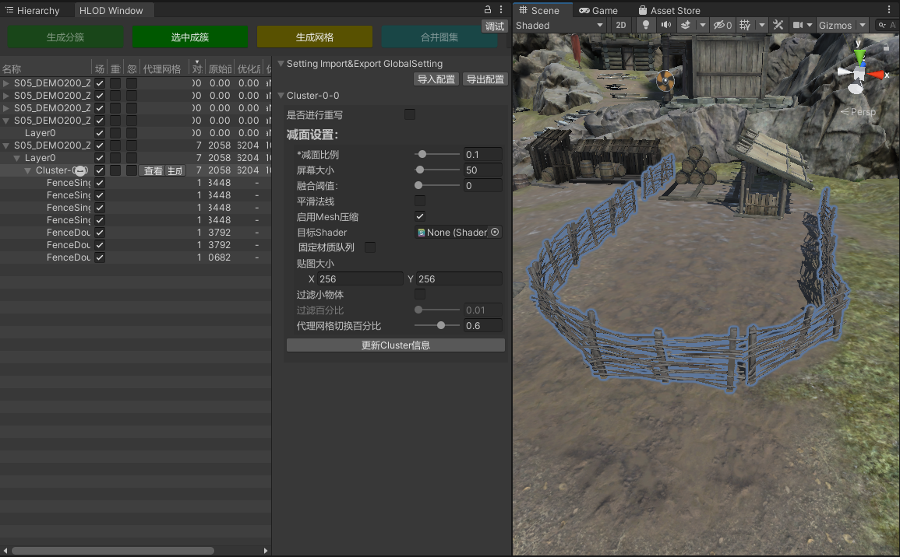
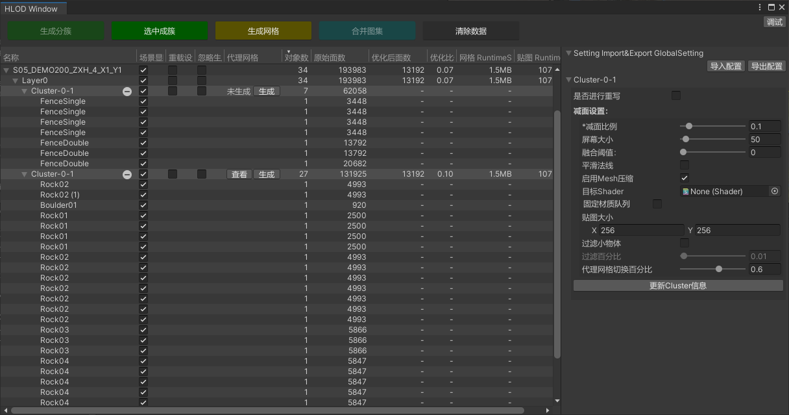

# [com.pwrd.hlod](http://10.17.17.13/athena/package/com.pwrd.hlod)
**安装**  
* hlod依赖:
  * [[com.pwrd.meshsimplify]](http://10.17.17.13/athena/package/com.pwrd.meshsimplify)  

* 如果需要使用Simplygon的功能，请做以下操作：
  * 添加宏USE_SIMPLYGON
  * 如果你的项目中存在ICSharpCode.SharpZipLib.dll,则忽略此条，否则请将com.pwrd.meshsimplify/Editor/Tools/Plugins下的ICSharpCode.SharpZipLib.xxx复制到项目的Assets文件夹下，并将后缀改为dll。
  * 使用Simplygon减面不安装SDK，需要先在*Athena*/Simplygon/注册Simplygon 注册免费License，需要登录微软账号，没有可通过邮箱申请一个

**使用文档**  
* https://kms.sys.wanmei.net/pages/viewpage.action?pageId=56474793  

**参数详情**  
* https://kms.sys.wanmei.net/pages/viewpage.action?pageId=56476344  

**界面展示**  
*   
* 