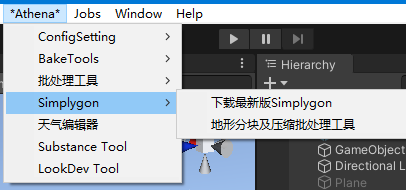
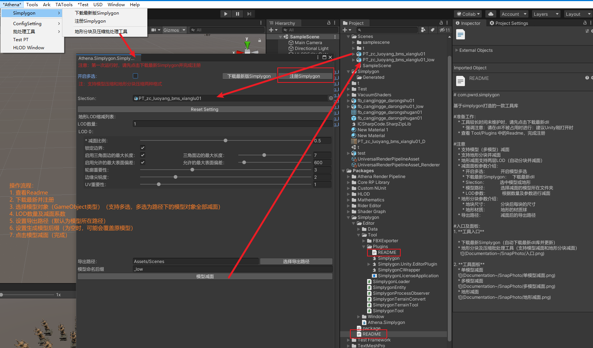
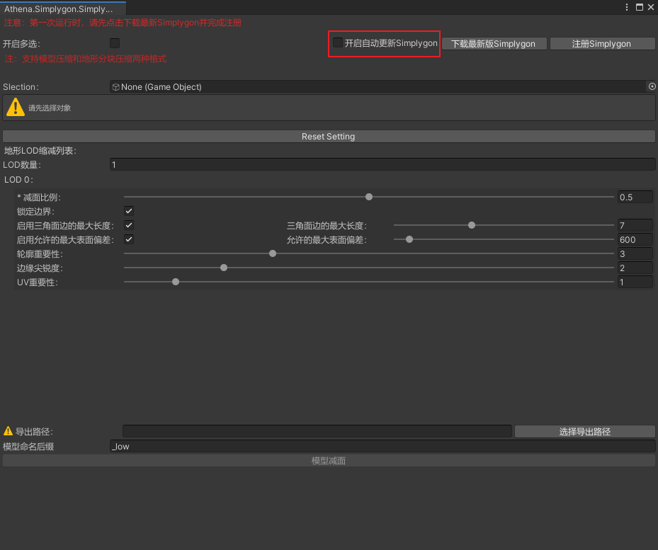
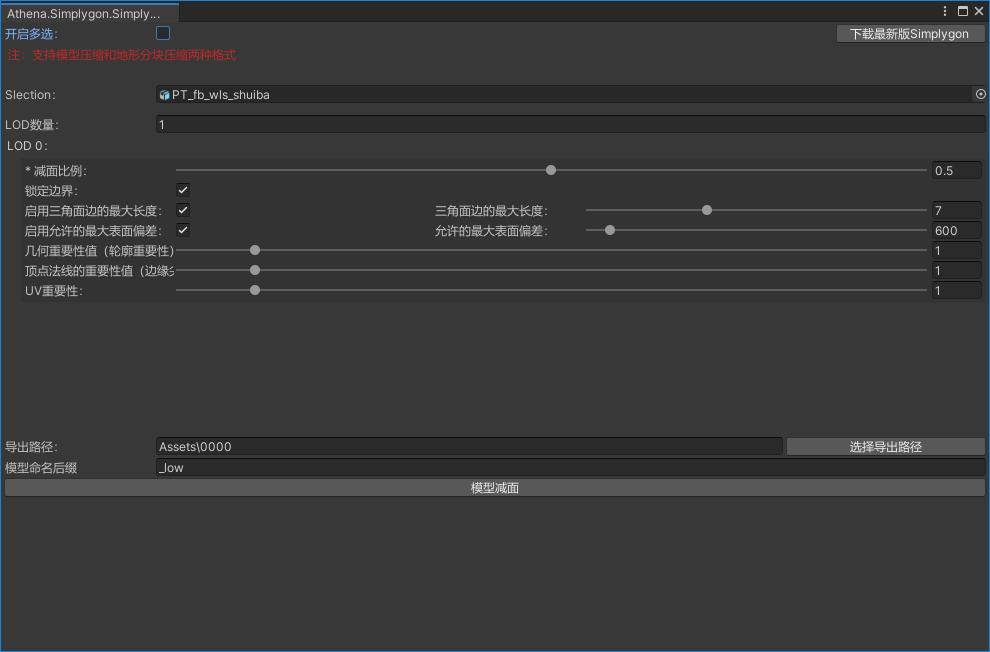
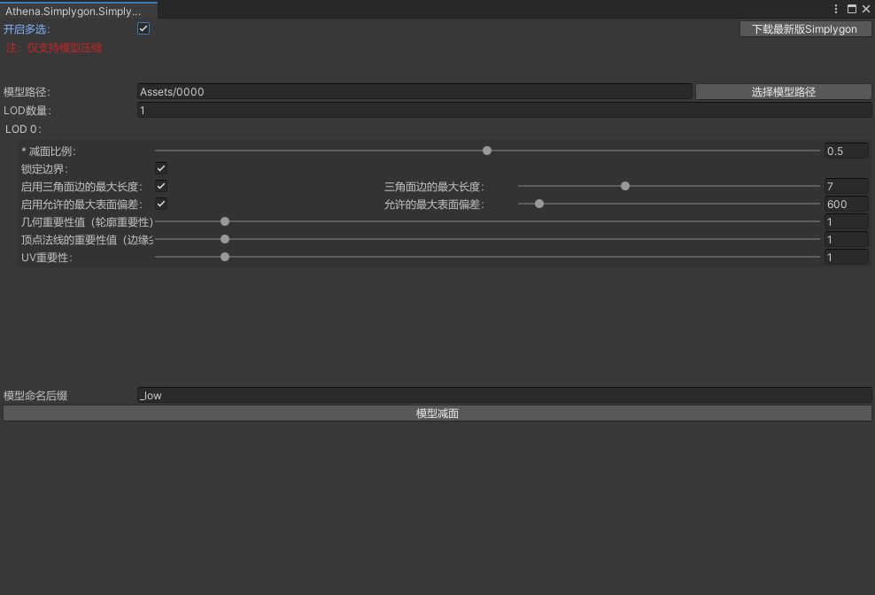
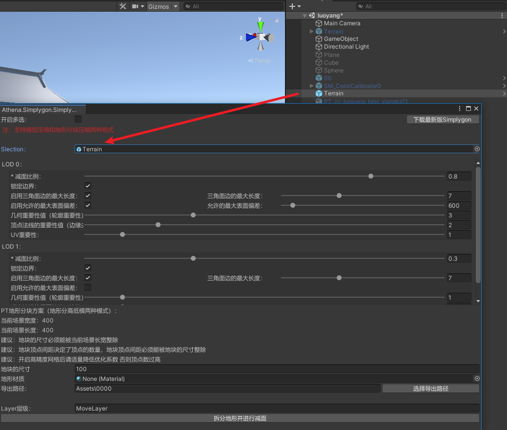

# com.pwrd.simplygon

**基于simplygon打造的一款工具库**
* 注意：如果需要使用Simplygon的功能，请做以下操作：
  * 添加宏USE_SIMPLYGON
  * 如果你的项目中存在ICSharpCode.SharpZipLib.dll,则忽略此条，否则请将com.pwrd.meshsimplify/Editor/Tools/Plugins下的ICSharpCode.SharpZipLib.xxx复制到项目的Assets文件夹下，并将后缀改为dll。
  * 工具较长时间未维护时，请先点击下载最新dll
  * 强调注意：请在dll不被占用时进行：建议Unity刚打开时
  * 查看 Tool/Plugins 中的Readme，完成注册

**注意**
   * 支持模型（多模型）减面
   * 支持地形分块并减面（地形由于精度过高，会先进性默认减面（预设参数为经验值），再进行LOD）
   * 地形减面支持两层LOD（自动分块并减面）
   * 减面面板参数介绍：
        * 开启多选：            开启模型多选
        * 下载最新Simplygon：   下载最新dll
        * Slection：            选中模型或地形
        * 模型路径：            选择减面的模型所在文件夹
        * LOD参数：             根据数量及参数进行减面  
   * 地形分块参数介绍：
        * 地块尺寸：            分块后每块的尺寸
        * 地形材质：            地形的材质球
   * 导出路径：                减面后的导出路径

**入口及面板**
1. 工具入口
   
    * 下载最新Simplygon（自动下载最新dll库并更新）
    * 地形分块及压缩批处理工具（支持模型减面和地形分块减面）
      
    * 界面总览
    
    * 开启自动检查更新Simplygon（美术同学开启即可）
    
     
2. 工具面板
    * 单模型减面
    
    * 多模型减面
    
    * 地形减面
    
      
