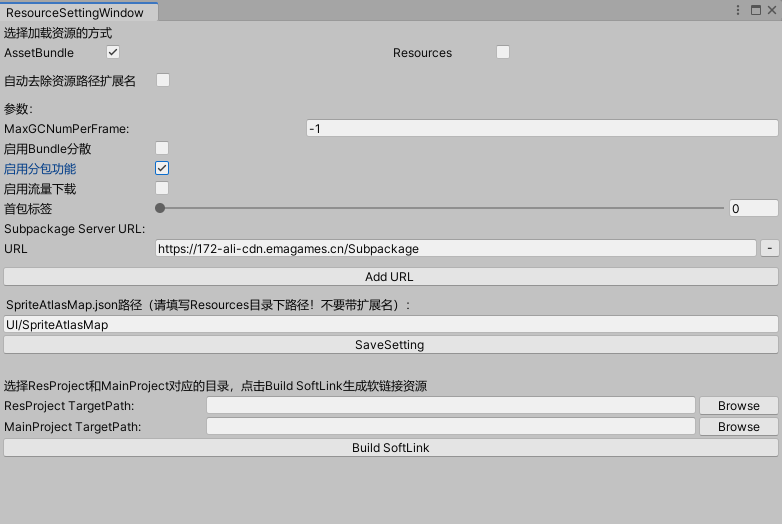
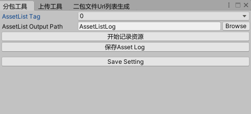
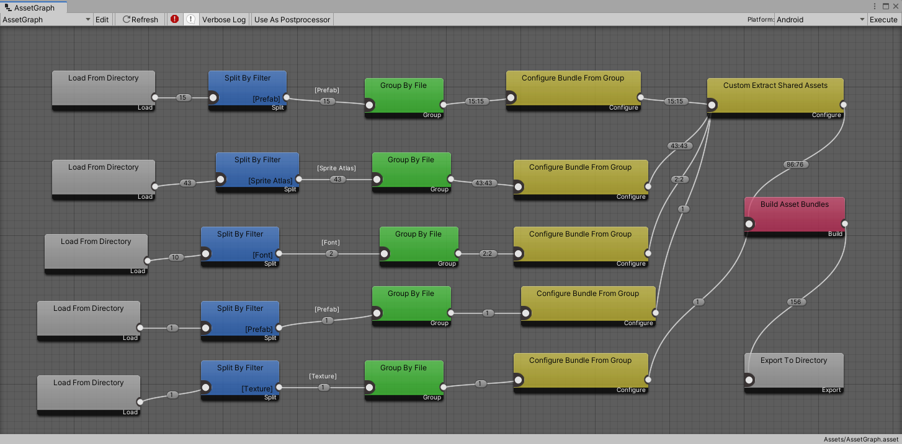

# Zeus资源框架说明
- [Zeus资源框架说明](#zeus资源框架说明)
  - [一.资源框架功能特点介绍](#一资源框架功能特点介绍)
  - [二.资源管理](#二资源管理)
    - [1. 配置](#1-配置)
    - [2.初始化](#2初始化)
    - [3.AssetManager API](#3assetmanager-api)
  - [三.分包功能](#三分包功能)
    - [1.资源记录工具的使用](#1资源记录工具的使用)
    - [2.分包打包流程](#2分包打包流程)
    - [3.分包功能接口说明](#3分包功能接口说明)
      - [3.1. SubpackageState](#31-subpackagestate)
      - [3.2 SubpackageError](#32-subpackageerror)
  - [四.打包](#四打包)

## 一.资源框架功能特点介绍

- 逻辑上完全屏蔽bundle概念，逻辑层直接使用asset,无需关心bundle概念，简化使用逻辑。
- 图形化配置方式，方便根据业务特点定制打包策略。
- 同一套接口支持Resource和Bundle方式无缝切换，编辑器下使用Resource模式，正式打包使用bundle方式，解决开发期build bundle慢影响开发迭代速度问题
- 多种类型接口，支持同步/异步/加急异步等方式加载资源。自动处理依赖资源
- 支持分包功能
  - 编辑器下分包工具，不用打包即可快速分包。
  - 支持边玩边下，在独立线程中处理，不影响正常游戏，极低内存和CPU开销。
  - 经过专业优化的下载策略，大量碎小bundle也不会影响下载速度。
- 提供资源和代码分离方案，资源和代码逻辑分开GIT/SVN仓库，方便权限管理
- 提供LUA层接口
- 启动速度和内存占用经过严格优化，解决大规模项目启动和内存占用问题。
- 可根据需求定制多种风格接口，适配项目组使用习惯和既有逻辑代码。

## 二.资源管理

### 1. 配置

在EditorMenu中选择`Zeus->Setting->Asset->ResourceSettingWindow`打开设置窗口，进行资源模块的相关设置.



- `选择资源加载方式`：用于切换资源加载方式AssetBundle/Resources
- `启用Bundle分散` ：解决android平台加载bundle变慢问题
- `启用分包功能`：控制分包功能的开启和关闭
- `启用流量下载`：是否默认开启流量下载功能
- `首包标签`：决定哪些内容将打入首包，选中的标签及之前的标签对应的内容都会打入首包中
- `URL`：二包资源下载地址（运行时可以更改）
- `Add URL`：添加二包资源下载地址（支持多个下载地址）
- `Build SoftLink`：提供软连接工具，提供资源和代码分离方案。


### 2.初始化

使用资源管理功能之前需要调用AssetManager.Init进行初始化，初始化应在框架启动之后进行。调用方法可参考StartGame.cs
```c#
AssetManager.Init();
```
### 3.AssetManager API

资源管理实现了以下几个接口（默认推荐接口风格，可以支持其他风格）

<details>
<summary><font color="red">LoadAsset</font> 同步加载资源</summary>

```C#
/// <summary>
/// 同步方式加载资源
/// </summary>
/// <param name="path">资源路径</param>
/// <returns>资源引用</returns>
public static IAssetRef LoadAsset(string path);

/// <summary>
/// 同步方式加载资源
/// </summary>
/// <param name="path">资源路径</param>
/// <param name="type">资源类型</param>
/// <returns>资源引用</returns>
public static IAssetRef LoadAsset(string path, Type type);
```
</details>
<details>
<summary><font color="red">LoadAssetAsync</font> 异步加载资源</summary>

```C#
/// <summary>
/// 异步方式加载资源
/// </summary>
/// <param name="path">资源路径</param>
/// <param name="callback">回调函数</param>
/// <param name="param">透传参数</param>
public static void LoadAssetAsync(string path, Action<IAssetRef, object> callback, object param);

/// <summary>
/// 异步方式加载资源
/// </summary>
/// <param name="path">资源路径</param>
/// <param name="type">资源类型</param>
/// <param name="callback">回调函数</param>
/// <param name="param">透传参数</param>
public static void LoadAssetAsync(string path, Type type, Action<IAssetRef, object> callback, object param);
```
</details>
<details>
<summary><font color="red">LoadAssetUrgent</font> 加急方式异步加载资源</summary>

```C#
/// <summary>
/// 加急方式加载资源
/// </summary>
/// <param name="path">资源路径</param>
/// <param name="callback">回调函数</param>
/// <param name="param">透传参数</param>
public static void LoadAssetUrgent(string path, Action<IAssetRef, object> callback, object param);

/// <summary>
/// 加急方式加载资源
/// </summary>
/// <param name="path">资源路径</param>
/// <param name="type">资源类型</param>
/// <param name="callback">回调函数<资源引用，透传参数></param>
/// <param name="param">透传参数</param>
public static void LoadAssetUrgent(string path, Type type, Action<IAssetRef, object> callback, object param);
```
</details>
<details>
<summary><font color="red">LoadScene</font> 同步加载场景</summary>

```C#
/// <summary>
/// 同步加载场景方法
/// </summary>
/// <param name="path">资源路径</param>
/// <param name="loadMode">LoadSceneMode</param>
public static void LoadScene(string path, LoadSceneMode loadMode);
```
</details>
<details>
<summary><font color="red">LoadSceneAsync</font> 异步加载场景</summary>

```C#
/// <summary>
/// 异步加载场景方法
/// </summary>
/// <param name="path"></param>
/// <param name="loadMode"></param>
/// <param name="callback"></param>Action<是否加载完成, 加载进度, 透传参数>
/// <param name="param"></param>透传参数
public static void LoadSceneAsync(string path, LoadSceneMode loadMode, Action<bool, float, object> callback, object param);
```
</details>

<details>
<summary><font color="red">UnloadSceneAsync</font> 异步卸载场景</summary>

```C#
/// <summary>
/// 卸载场景方法
/// </summary>
/// <param name="path">资源路径</param>
/// <param name="callback"> 回调Action<是否完成, 加载进度, 透传参数></param>
/// <param name="param">透传参数</param>
public static void UnloadSceneAsync(string path, Action<bool, float, object> callback, object param);
```
</details>

<details>
<summary><font color="red">UnloadAsset</font> 卸载资源</summary>

```C#
/// <summary>
/// 卸载资源方法，可以在切换场景等场合主动调用
/// </summary>
public static void UnloadAsset();
```
</details>

<details>
<summary><font color="red">UnloadBundleAndReInit</font> 重新初始化Bundle相关数据</summary>

```C#
/// <summary>
/// 重新初始化bundle相关数据，一般配合热更新逻辑使用
/// </summary>
public static void UnloadBundleAndReInit();
```
</details>


资源加载接口会返回一个资源引用对象（IAssetRef），通过AssetObject属性获取加载的Asset对象。如果需要持有该资源时，调用Retain方法，不再使用该资源时调用Release接口释放资源。Retain()和Release()需要配对使用。下面为资源加载使用样例：
```C#
public class AssetExampleScript : MonoBehaviour
{
    Material _material;
    IAssetRef _textureRef;
    
    void Start()
    {
        //异步加载资源
        AssetManager.LoadAssetAsync("SomeDir/texture2", this.LoadAssetAction, null);
    }

    private void LoadAssetAction(IAssetRef assetRef, object param)
    {
        //保持对资源的引用
        assetRef.Retain();
        _textureRef = assetRef;
        //获取资源对象并使用
        _material.mainTexture = assetRef.AssetObject as Texture2D;
    }

    
    void OnDestory()
    {
        //解决对资源的引用，资源管理器会及时释放该资源
        _textureRef.Release();
        _textureRef = null;
    }
}
```

## 三.分包功能

### 1.资源记录工具的使用

1.	在EditorMenu中选择Zeus->Setting->分包->分包工具



2.	点击“开始记录资源”，当按钮文字显示“停止记录资源”则表示记录资源功能已开启，启动游戏就可以开始记录资源
3.	AssetListTag中设置此次资源记录的标签，标签用于标记资源使用顺序
4.	Asset Output Path栏设置记录保存路径，路径使用相对于工程目录的相对路径名。
5.	点击“保存Asset Log”会将记录保存到上一项设置的路径中，文件以“Tag_精确到毫秒的时间.json”命名来避免提交冲突。Editor下退出游戏时，如果没有手动保存Asset Log则会自动保存一次

### 2.分包打包流程
通过资源模块设置窗口(`ResourceSettingWindow`)可以设置分包相关的参数，包括首包标签和二包资源下载地址。首包标签对应的是资源记录时的记录标签，打包时会把该标签包括在内的所有小于该标签的资源记录文件中记录的资源引用的AssetBundle打入首包内。

开启分包功能并成功打包之后，输出路径下会有`packagename.apk`和`packagename.subpackage`两个文件，后者对应的是二包资源。

### 3.分包功能接口说明

AssetManager中也提供了一系列分包功能的接口

<details>
<summary><font color="red">DownloadSubpackageBundles</font> 多线程不限速下载二包资源</summary>

```C#
/// <summary>
/// 下载分包资源，使用多线程
/// </summary>
/// <param name="maxDownloadingCount">最大线程数</param>
/// <param name="downloadingProgressCallback">回调函数参数分别为已下载大小(Byte)，总大小(Byte)，平均速度(Byte/S)，是否完成下载，是否有异常(返回优先级最高的异常)。完成下载并且异常为None才表示成功下载</param>
public static void DownloadSubpackageBundles(int maxDownloadingCount = 4, Action<double, double, double, SubpackageState, SubpackageError> downloadingProgressCallback = null);
```
</details>

<details>
<summary><font color="red">DownloadSubpackageInBackground</font> 后台限速下载二包资源</summary>

```C#
/// <summary>
/// 后台下载分包资源，使用两个线程并限速
/// </summary>
/// <param name="limitSpeed">限制最大下载速度，单位为Byte/s</param>
/// <param name="downloadingProgressCallback">回调函数参数分别为已下载大小(Byte)，总大小(Byte)，平均速度(Byte/S)，是否完成下载，是否有异常(返回优先级最高的异常)。完成下载并且异常为None才表示成功下载</param>
public static void DownloadSubpackageInBackground(double limitSpeed, Action<double, double, double, SubpackageState, SubpackageError> downloadingProgressCallback = null);
```
</details>

<details>
<summary><font color="red">IsSubpackageReady</font> 二包资源是否准备完毕</summary>

```C#
/// <summary>
/// 分包资源是否就绪(已经下载完成)
/// 返回false需要调用DownloadSubpackageBundles下载分包资源。
/// 返回true 分包资源已经准备好。
/// </summary>
public static bool IsSubpackageReady();
```
</details>

<details>
<summary><font color="red">PauseDownloading</font> 暂停下载</summary>

```C#
/// <summary>
/// 暂停下载
/// </summary>
public static void PauseDownloading();
```
</details>

<details>
<summary><font color="red">SetCarrierDataNetworkDownloading</font> 设置是否允许使用流量下载</summary>

```C#
/// <summary>
/// 设置是否允许流量下载
/// </summary>
/// <param name="isAllowed"></param>
public static void SetCarrierDataNetworkDownloading(bool isAllowed);
```
</details>

<details>
<summary><font color="red">GetCarrierDataNetworkDownloadingAllowed</font> 获取流量下载设置</summary>

```C#
/// <summary>
/// 获取是否允许流量下载
/// </summary>
/// <returns></returns>
public static bool GetCarrierDataNetworkDownloadingAllowed();     
```
</details>

<details>
<summary><font color="red">SetCdnUrl</font> 修改下载地址</summary>

```C#
/// <summary>
/// 修改二包资源下载Url
/// </summary>
/// <param name="urlsStr">用';'分割多个Url</param>
public static void SetCdnUrl(string urlsStr);
```
</details>

#### 3.1. SubpackageState

```C#
    enum SubpackageState
    {
        //空闲阶段，不用处理
        Idle,
        //准备好开始下载
        Ready,
        //下载阶段，提供进度
        Downloading,
        //WIFI切换到运营商网络的自动暂停状态
        WaitLocalAreaNetwork,
        //错误处理阶段
        DownloadingError,
        //错误处理阶段
        SplitingError,
        //暂停
        Pause,
        //文件分割阶段，提供进度
        Spliting,
        //出现错误，根据SubpackageError参数弹窗提示
        Abort,
        //下载并且分割完成
        Complete
    }
```
其中`Downloading`, `WaitLocalAreaNetwork`, `Pause`, `Abort`四个阶段可能会作为参数回调给上层，`Downloading`会多次回调，其余的只会回调一次

#### 3.2 SubpackageError

```C#
public enum SubpackageError
    {
        /// <summary>
        /// 没有错误
        /// </summary>
        None = 0,
        /// <summary>
        ///暂停
        Pause,
        /// <summary>
        ///没有开启非WIFI环境自动下载时，WIFI切换到运营商网络会回调这个错误
        /// </summary>
        NetworkChange,
        /// <summary>
        /// 下载的分包资源解压或是分割失败。提示用户重试或联系客服。
        /// </summary>
        DecodeError,
        /// <summary>
        /// 下载的分包资源文件MD5值不正确,校验失败。提示用户重试或联系客服。
        /// </summary>
        MD5Error,
        /// <summary>
        /// 下载分包资源文件失败。提示用户检查网络并重试。
        /// </summary>
        DownloadError,
        /// <summary>
        /// 找不到要下载的文件错误。提示用户联系客服。
        /// </summary>
        HttpStatusCode404Error,
        /// <summary>
        /// 磁盘空间不足错误。提示用户清理磁盘空间。
        /// </summary>
        HardDiskFullError,
        /// <summary>
        /// bundlelist中找不到bundle。(这个错误一般不会出现)
        /// </summary>
        MissingError
    }
```

其中错误类型`SubpackageError.Pause`和状态`SubpackageState.Pause`, 错误类型`SubpackageError.NetworkChange`和状态`SubpackageState.WaitLocalAreaNetwork` 是成对出现的，无论对状态还是错误类型进行判断都可，其余的错误类型需要在状态为`SubpackageState.Abort`的时候去判断和处理。

补充说明:
- 无论是前台还是后台下载，当状态为`SubpackageState.WaitLocalAreaNetwork`都表示当前处于运营商(4G/5G)网络，并且没有开启流量下载功能，如果此时切换为Wifi环境，会自动切换为下载状态，不需要再次调用下载接口
- 前台下载时遇到下载错误都会将状态切换为`SubpackageState.Abort`并回调，如需继续下载需要重新调用下载接口; 后台下载时遇到网络环境问题如弱网，网络连接断开不会回调给上层，而是每隔两秒自动重试一次。

## 四.打包
基于图形化配置的打包方案，方便根据资源和业务特点定制bundle打包策略。

