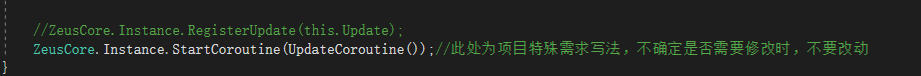

##### 项目组在原则上不允许修改Zeus框架代码，如有特殊需求，尽量通过扩展、继承、分部类等隔离源文件的形式来实现，并将添加的源文件放在此Extension文件夹内，如果只能通过修改Zeus框架源码的形式类实现特殊需求，那么需要在 Extension/Editor/更新注意事项.md 文件内添加改动详情，详情包括但不限于修改的文件名、行数、截图、修改原因等，截图可放在 Extension\Editor\Images 文件夹内。

示例:

##### 1、AssetBundleLoader.cs

原因：项目特殊写法，防止UI跳转时出现卡顿。